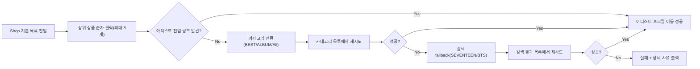

# Makestar E2E Tests

Makestar.com 서비스 E2E 모니터링 테스트 (Playwright + Page Object Model)

## 프로젝트 구조

```
├── playwright.config.js          # 로컬 실행용 설정
├── playwright.ci.config.js       # CI 전용 설정
├── global-setup.js               # 테스트 전 토큰 검증/갱신
├── auto-refresh-token.js         # 토큰 자동 갱신 모듈
├── .github/workflows/
│   └── playwright.yml            # GitHub Actions CI 워크플로우
└── tests/
    ├── cmr_monitoring_pom.spec.ts      # CMR 모니터링 (29개 TC)
    ├── ab_monitoring_pom.spec.ts       # AlbumBuddy 모니터링
    ├── admin_auth_pom.spec.ts          # Admin 인증 Setup
    ├── admin_product_pom.spec.ts       # Admin 상품 관리
    ├── save-auth.spec.ts               # CMR 로그인 세션 저장
    ├── ab-save-auth.spec.ts            # AB 로그인 세션 저장
    ├── pages/                          # Page Object Models
    │   ├── base.page.ts                #   공통 베이스
    │   ├── makestar.page.ts            #   CMR 페이지
    │   ├── albumbuddy.page.ts          #   AlbumBuddy 페이지
    │   └── admin-*.page.ts             #   Admin 페이지들
    ├── helpers/                        # 헬퍼 유틸리티
    │   ├── auth-helper.ts              #   인증 헬퍼
    │   └── admin/                      #   Admin 전용 헬퍼
    └── fixtures/                       # 테스트 데이터
```

## 로컬 실행

### 사전 준비

```bash
npm install
npx playwright install chromium
```

### 최초 로그인 (세션 저장)

```bash
# CMR 세션
npx playwright test tests/save-auth.spec.ts --headed

# AlbumBuddy 세션
npx playwright test tests/ab-save-auth.spec.ts --headed --project=chromium
```

### 테스트 실행

```bash
# CMR 모니터링
npm run test:cmr

# Admin 테스트 (인증 Setup 포함)
npm run test:admin

# 전체 실행 (수동 인증 저장 스펙 제외: save-auth / ab-save-auth)
npm test

# 특정 테스트만 실행
npx playwright test -g "TC-HOME"

# 브라우저 표시 모드
HEADED=true npm run test:cmr
```

### 커버리지 대시보드 업데이트 (Admin 로컬 실행 후)

Admin 테스트는 CI에서 안 돌기 때문에, 로컬 실행 결과를 QA Hub 커버리지 대시보드에 반영하려면:

```bash
# 전체 admin 테스트 실행 + 결과 자동 ingest
scripts/refresh-coverage.sh

# 특정 spec만
scripts/refresh-coverage.sh admin_order_pom admin_user_pom
```

- 결과는 [https://makestar-qa-hub.vercel.app/coverage](https://makestar-qa-hub.vercel.app/coverage)에 즉시 반영
- `~/Projects/makestar-qa-hub/.env.local`의 `DATABASE_URL` 필요

## CI (GitHub Actions)

`main`/`master` 브랜치에 push 또는 PR 시 자동 실행됩니다.

### 필요한 GitHub Secret

| Secret         | 설명                                                    |
| -------------- | ------------------------------------------------------- |
| `AUTH_JSON`    | `auth.json` 파일 내용 (로그인 세션)                     |
| `AB_AUTH_JSON` | `ab-auth.json` 파일 내용 (AlbumBuddy 로그인 세션, 선택) |

Settings > Secrets and variables > Actions > New repository secret

### 수동 실행

Actions 탭 > Playwright Tests > Run workflow

- `suite`: `cmr | albumbuddy | admin | all`
  - `admin`: GitHub Hosted Runner에서는 실행 불가 (사내 VPN/IP allowlist 필요)
  - `all`: `cmr + albumbuddy` 실행, `admin`은 자동 제외
- `project`: Playwright 프로젝트 직접 지정(선택)
- `spec`: 특정 스펙 파일 경로(선택)
- `grep`: 특정 테스트 패턴 (예: `TC-HOME`, `TC-SEARCH`)
- `retries`: 재시도 횟수

### CI 설정 (`playwright.ci.config.js`)

- headless 고정
- chromium만 사용
- 프로젝트별 실행:
  - `cmr-monitoring`: `cmr_monitoring_pom.spec.ts`
  - `albumbuddy-monitoring`: `ab_monitoring_pom.spec.ts`
- `admin-setup` + `admin-pc`: Admin 시나리오
- globalSetup 비활성 (CI에서 수동 로그인 불가)

## 비개발자 실행/결과 확인 가이드

### 1) 어디서 실행하나요?

GitHub 저장소의 Actions 탭에서 실행합니다.

1. [Actions](https://github.com/dykim0518/makestar-e2e-tests/actions) 접속
2. 왼쪽에서 `Playwright Tests` 선택
3. 우측 `Run workflow` 클릭
4. 기본 추천값:
   - `suite`: `cmr`
   - `retries`: `0` (문제 재현 시), `1` (일반 모니터링 시)
5. `Run workflow`로 실행

### 2) 실행 중 어디를 보면 되나요?

실행 화면에서 `Playwright Monitoring` 잡을 열고 아래 순서로 확인합니다.

1. `Run Playwright tests` 단계가 진행 중인지 확인
2. 완료 후 `Publish run summary`에서 통계 확인
   - `unexpected`: 실패 개수
   - `flaky`: 재시도 후 통과 개수

### 3) 결과는 어디서 확인하나요?

완료된 run 하단 Artifacts에서 확인합니다.

- `playwright-report-...`
  - 다운로드 후 `index.html` 열어 전체 테스트 리포트 확인
- `test-results-...`
  - 실패 시 `trace.zip`, `error-context.md`, `test-failed-1.png` 확인

### 4) CMR-DATA-01 안정화 동작 (아티스트 프로필 이동)

`CMR-DATA-01`은 상품 상세에서 아티스트 진입 링크가 없는 상품이 나와도 바로 실패하지 않고 아래 순서로 재시도합니다.



실패 시 로그에 어떤 단계까지 시도했는지(기본 목록/카테고리/검색)가 함께 남습니다.

## 테스트 목록 (CMR 모니터링)

| 그룹             | TC ID                        | 설명                        |
| ---------------- | ---------------------------- | --------------------------- |
| A. 기본 페이지   | TC-HOME ~ TC-PRODUCT         | Home, Event, Product 페이지 |
| B. GNB           | TC-NAV-SHOP ~ TC-NAV-FUNDING | Shop, Funding 이동          |
| C. 검색          | TC-SEARCH ~ TC-RECENT        | 검색 UI, 결과, 필터         |
| D. 마이페이지    | TC-MYPAGE ~ TC-RAFFLE        | 주문, 배송지, 응모          |
| E. 상품/장바구니 | TC-OPTION ~ TC-GUEST         | 옵션, 품절, 장바구니        |
| F. 아티스트      | TC-ARTIST ~ TC-FILTER        | 프로필, 필터링              |
